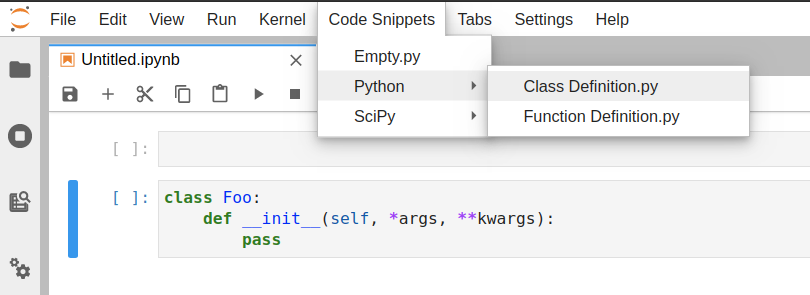

# jupyterlab-code-snippets


Code Snippets Extension for JupyterLab.

This extension is composed of a Python package named `jupyterlab-code-snippets`
for the server extension and a NPM package named `jupyterlab-code-snippets`
for the frontend extension.

## Requirements

- JupyterLab >= 2.0
- Node.js

## Install

```bash
pip install jupyterlab-code-snippets
jupyter lab build
```

## Usage

The default directory for snippets is `~/jupyterlab_code_snippets`.

The directory can be changed in `jupyter_notebook_config.py`:

```python
c.JupyterLabCodeSnippets.snippet_dir = "/path/to/snippets"
```

In JupyterLab, use the "Code Snippets" menu to select the snippet:




## Troubleshoot

If you are seeing the frontend extension but it is not working, check
that the server extension is enabled:

```bash
jupyter serverextension list
```

If the server extension is installed and enabled but you are not seeing
the frontend, check the frontend extension is installed and enabled:

```bash
jupyter labextension list
```

If it is installed, try:

```bash
jupyter lab clean
jupyter lab build
```

## Contributing

### Development Install

The `jlpm` command is JupyterLab's pinned version of
[yarn](https://yarnpkg.com/) that is installed with JupyterLab. You may use
`yarn` or `npm` in lieu of `jlpm` below.

```bash
# Clone the repo to your local environment
# Move to jupyterlab-code-snippets directory
# Install the server extension
pip install -e .

# Register the server extension
jupyter serverextension enable --py jupyterlab-code-snippets

# Install the dependencies
jlpm

# Build the TypeScript source
jlpm build

# Link your development version of the extension with JupyterLab
jupyter labextension link .

# Rebuild the TypeScript source after making changes
jlpm build

# Rebuild JupyterLab after making any changes
jupyter lab build
```

You can watch the source directory and run JupyterLab in watch mode to watch for changes in the extension's source and automatically rebuild the extension and application.

```bash
# Watch the source directory in another terminal tab
jlpm watch

# Run jupyterlab in watch mode in one terminal tab
jupyter lab --watch
```

### Uninstall

```bash
pip uninstall jupyterlab-code-snippets
jupyter labextension uninstall jupyterlab-code-snippets
```
